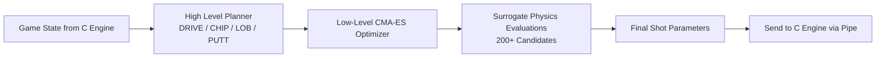

# 🎮🏌️ Project Golfero – AI-Driven 3D Golf Simulation

A hybrid Raylib + Python AI golf engine featuring hierarchical planning, surrogate physics, and CMA-ES optimization.


---

## 📘 Table of Contents

* [Overview](#overview)
* [Architecture](#architecture)
* [System Pipeline (Mermaid)](#system-pipeline-mermaid)
* [Components](#components)
* [Physics Engine](#physics-engine)
* [AI System](#ai-system)
* [IPC Communication](#ipc-communication)
* [Controls](#controls)
* [File Structure](#file-structure)
* [Build & Run](#build--run)
* [Development Notes](#development-notes)
* [Troubleshooting](#troubleshooting)
* [License](#license)
* [Credits](#credits)

---

## Overview

**Project Golfero** is a top-down 3D golf simulation built with **C/Raylib** and a powerful **Python AI golfer**.
The AI performs high-level shot planning, optimization via **CMA-ES**, and uses a fast **surrogate physics** model to evaluate hundreds of trajectories before executing the best shot.

---

## Architecture

```
┌───────────────────────────────────────────────────────────────────────┐
│                               PROJECT GOLFERO                         │
├───────────────────────────────────────────────────────────────────────┤
│                                                                       │
│   ┌───────────────────────────┐       Named Pipes       ┌───────────┐ │
│   │     Raylib C Engine      │  <────────────────────→  │  Python   │ │
│   │                           │  →────────────────────→  │   AI      │ │
│   │ - Rendering               │                         │ (Planner + │ │
│   │ - Physics                 │                         │ Optimizer) │ │
│   │ - Shot Mechanics          │                         │           │ │
│   └───────────────────────────┘                         └───────────┘ │
│                                                                       │
└───────────────────────────────────────────────────────────────────────┘
```

---

## System Pipeline (Mermaid)



---

## Components

### Raylib C Engine

* 60 FPS physics
* Realistic terrain interactions
* Rendering + input
* Menu system
* IPC bridge

### Python AI Brain

* High-level shot strategy
* CMA-ES optimization
* Surrogate physics model
* Wind + terrain compensation

---

## Physics Engine


### Core Constants

```c
#define GRAVITY_ACCEL 800.0f
#define DT 0.016f
#define AIR_DRAG_COEF 1.6f
#define MAX_WIND_STRENGTH 50.0f
#define MAGNUS_COEF 0.0012f
#define STOP_SPEED 2.0f
```

### Physics Pipeline (ASCII)

```
[Start Frame]
     |
     v
[Apply Gravity] ──→ [Update Position]
     |
     v
Is Ball Airborne?
     | Yes
     v
[Apply Wind + Drag + Magnus Spin]
     |
     v
[Check Collision / Bounce]
     |
     v
Is Ball Slow Enough?
     | Yes
     v
[Stop Ball]
```

### Terrain Types

| Terrain      | Roll | Bounce | Launch | Effect    |
| ------------ | ---- | ------ | ------ | --------- |
| Fairway      | 0.96 | 0.60   | 1.00   | Standard  |
| Smooth/Green | 0.98 | 0.75   | 1.05   | Fast roll |
| Rough        | 0.80 | 0.55   | 0.85   | Slow      |
| Sand         | 0.45 | 0.05   | 0.35   | Trap      |
| Water        | 0.92 | 0.00   | 0.00   | Hazard    |
| Forest       | 0.40 | 0.00   | 0.40   | Hard stop |

---

## AI System


### High-Level Planner

```
Distance < 30px   → PUTT
Distance < 80px   → CHIP
Distance < 150px  → LAYUP
Distance > 150px  → DRIVE
```

* Hazard avoidance
* Terrain-aware planning
* Wind adjustment
* Waypoint selection

### Low-Level Optimizer (CMA-ES)

Optimizes:

* Direction angle
* Launch angle
* Power
* SpinX
* SpinY

| Mode | Time  | Evaluations | Use       |
| ---- | ----- | ----------- | --------- |
| Fast | <0.1s | 1           | Demo      |
| Full | 1–2s  | 200+        | Best play |

### Surrogate Physics

Fast trajectory model:

* Simplified drag
* Basic bounce
* Terrain approx
* Evaluates 200–500 candidates

---

## IPC Communication

### Pipes

* `/tmp/golf_ai_pipe` – AI → C
* `/tmp/golf_state_pipe` – C → AI

### AI Command Struct

```c
struct AICommand {
    float dirx, diry;
    float angle;
    float power;
    float spinx, spiny;
};
```

---

## Controls

| Control    | Action             |
| ---------- | ------------------ |
| Mouse Drag | Aim + Power        |
| UP / DOWN  | Loft angle         |
| W / S      | Backspin / Topspin |
| A / D      | Left / Right spin  |
| R          | Reset hole         |
| ESC        | Menu               |

---

## File Structure

```plaintext
Project_Golfero/
├── main_with_menu.c
├── golf_menu
├── golf_map.png
├── README.md
└── ai_golfer/
    ├── ai_pipe_client.py
    ├── high_level_planner.py
    ├── low_level_optimizer.py
    ├── surrogate_physics.py
```

---

## Build & Run

### Compile

```
gcc main_with_menu.c -o golf_menu -lraylib -lm -lpthread -ldl
```

### Play

```
./golf_menu
```

### AI Demo

```
# Terminal 1
./golf_menu

# Terminal 2
python3 ai_golfer/ai_pipe_client.py
```

---

## Development Notes

* Add new terrains by modifying `getTerrainProps()`.
* Adjust physics constants in `main_with_menu.c`.
* Improve AI via CMA-ES parameters and planner thresholds.

---

## Troubleshooting

* If AI doesn't connect: ensure pipes exist (`ls /tmp/golf_*`).
* Start Python *after* selecting AI Demo.
* Use full CMA-ES for best accuracy.

---

## License

Educational / Non-commercial.

---

## Credits

* Physics Engine — Custom C
* AI System — Python, CMA-ES
* Graphics — Raylib
* Architecture — Project Golfero
